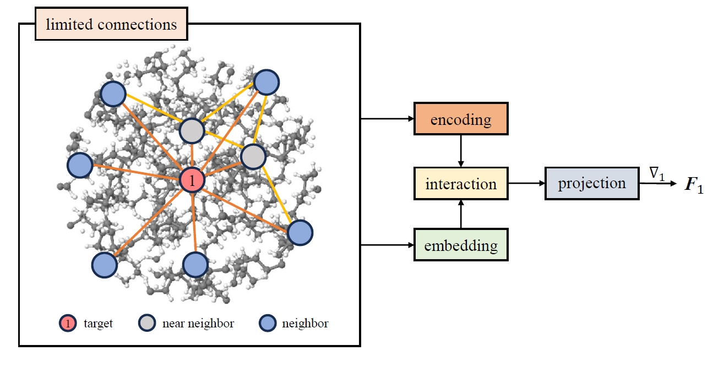

# trimmed SchNet 
## Machine learning surrogate models of many-body dispersion interactions in polymer melts
Trimmed SchNet is a machine learning surrogate model designed to predict many-body dispersion (MBD) forces in polymer melts. Building on SchNet's core geometric encoding and continuous-filter convolutions, the model features a simplified architecture with trimmed atomic connections, significantly reducing computational costs while retaining essential many-body correlations. It also includes trainable radial basis function (rbf) encoding to minimize the number of encoding bases and adopts a unit-specific batching strategy inspired by polymer repeat units to enhance training convergence. The details of the architecture can be found in the paper.

<br />



<br />

The model takes an atomic cluster (vdW interaction cutoff) as input and predict the MBD force on the center atoms. It has been validated on datasets from polyethylene, polypropylene, and polyvinyl chloride melts, demonstrating high predictive accuracy and robust generalization across diverse polymer systems. The polymer melt datasets used for the training and testing are available in [ZENODO](https://doi.org/10.5281/zenodo.15012728). 

This repository contains the TensorFlow implementations for the model and equivalent [FLAX_NNX](https://github.com/google/flax) implementation for incorporation in [JAX_MD](https://github.com/jax-md/jax-md). A demo for JAX_MD NVT simulation using the model is provided. 

## Instructions
### Train the model
1. Download the supplementary data from ZENODO and keep it under the same directory as the training code (`tensorflow` or `jax`).
2. To train the model, run `trimmed-SchNet/tensorflow/trimmed_SchNet_tf.py` or `trimmed-SchNet/jax/trimmed_SchNet_flax.py` as desired. Training target and hyperparameters can be set up easily, for example, in the TensorFlow code:
```python
# Training target
polymer = 'E'  # choose the polymer type (P + polymer, here is 'PE') or mixed cases. All studied cases in the paper are included. 
...
# Key hyperparameters, which are default settings as introduced in the paper. 
batch_size = 36
lr0 = 1e-3
rbf_trainable = True
num_interactions = 1
embedding_dim = 32
num_rbf = 100
N_extra = 50
```
3. Trained model will be saved as `checkpoints`, a dedicated folder for checkpoints is preferred. To resume training from a checkpoint, set `ep0` as the resumed epoch number.

### MD simulation
1. After installing `jax-md`, please introduce a few change to the library. See `trimmed-SchNet/jax/nvt_test.py`.
2. The MD example `nvt_test.py` performs NVT simulation for a 9k-atom PE melt decribed by `N6E250_nvt.gen`. This is just a primitive test code to show computational efficiency, therefore only the MBD forces is considered and the trimmed-SchNet model is not trained.
3. Set `steps` for numbers of MD simulation steps.
4. MD simulation code with complete force field is under development. 

## Dependencies
- `tensorflow==2.15.0`
- `jax==0.4.30`
- `jax-md==0.2.8`
- `flax==0.8.5`

All provided codes can run on CPU, but GPU acceleration is strongly recommended for training and fast MD simulations. Please install the appropriate CUDA and cuDNN versions following the official [TensorFlow](https://www.tensorflow.org/install/pip) and [JAX](https://github.com/jax-ml/jax) instructions for your hardware.

## Cite
```
@misc{trimmed-SchNet,
      title={Machine learning surrogate models of many-body dispersion interactions in polymer melts}, 
      author={Zhaoxiang Shen and Raúl I. Sosa and Jakub Lengiewicz and Alexandre Tkatchenko and Stéphane P. A. Bordas},
      year={2025},
      archivePrefix={arXiv},
      primaryClass={cs.LG},
      url={https://arxiv.org/abs/2503.15149}, 
}
```
